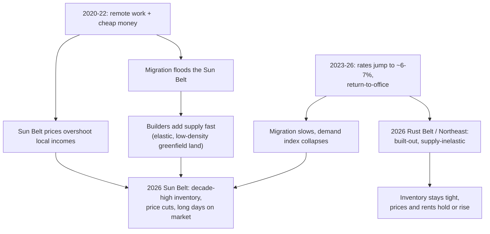

## Question

Which U.S. real estate markets are performing best **in 2026**, and what **urban form** — density, walkability, sprawl, supply elasticity — correlates with strong performance?

## Context

This is a **2026 outlook** with a **blended view** of performance (price, demand fundamentals, supply/inventory, and rent) across U.S. metros nationwide. It is built on the [Reventure App](https://www.reventure.app/) work specifically requested for this project, triangulated against two dozen further sources. (Synthesis history: drafted from 7 sources, then expanded to 27 across follow-up passes — see [log.md](../log.md).)

> [!NOTE]
> **Evidence vintage — this is a current read.** Hard data is fresh: FHFA prices through **Q4 2025**, Redfin and Reventure through **spring 2026**, Census population through **May 2026**. The 2026 forecasts (Reventure, Zillow, NAR, Realtor.com) were issued in late 2025 for the year ahead. A few structural studies are older — Brookings' housing-supply analysis (1950–2023) and walkability research (2023–24) — and are used **only as historical context that explains the 2026 picture**, never as current market readings. Where a 2025 figure appears, it is the just-closed record used to calibrate the 2026 forecast, and is labeled as such.

> [!IMPORTANT]
> **Headline finding:** The Sun Belt boom has inverted. The markets best positioned on **price and rent** in 2026 are supply-constrained **Northeast, Midwest/Great Lakes, and select coastal** metros. The Sun Belt still wins **population growth** — but that no longer translates into asset performance. The variable that predicts price/rent performance is **supply inelasticity**, not population growth, warm weather, or sprawl.

## At a glance — early 2026

```html preview
<div style="font-family:system-ui,sans-serif;padding:20px">
  <div id="cards" style="display:flex;gap:14px;flex-wrap:wrap"></div>
  <script>
    var stats = [
      ['Reventure Demand Index, Mar 2026', '11 / 100', 'buyer demand ~30% below pre-pandemic norm', 'var(--chart-5)'],
      ['Renting beats buying, Mar 2026', 'all 50 metros', 'avg $920/mo cheaper to rent (Realtor.com)', 'var(--chart-3)'],
      ['San Francisco metro, Mar 2026 YoY', '+14.4%', 'biggest jump of the 50 largest metros', 'var(--chart-2)'],
      ['Sun Belt population, 2024-25', 'still #1', 'Houston & DFW lead — yet 2026 prices forecast to fall', 'var(--chart-1)']
    ];
    document.getElementById('cards').innerHTML = stats.map(function (s) {
      return '<div style="flex:1;min-width:175px;padding:16px;background:var(--card);' +
        'color:var(--card-foreground);border:1px solid var(--border);border-radius:var(--radius)">' +
        '<div style="font-size:13px;color:var(--muted-foreground)">' + s[0] + '</div>' +
        '<div style="font-size:25px;font-weight:700;margin-top:4px">' + s[1] + '</div>' +
        '<div style="font-size:12px;font-weight:600;margin-top:4px;color:' + s[3] + '">' + s[2] + '</div>' +
        '</div>';
    }).join('');
  </script>
</div>
```

## Findings

### 1. The regional inversion — Sun Belt down, Rust Belt / Northeast up

Every current price-and-supply source converges on the same 2026 picture: a sharp regional bifurcation.

- **Zillow's** 10 hottest *for-sale* markets for 2026 (published April 2026) are almost entirely constrained legacy metros: Hartford, Buffalo, New York, Providence, San Jose, Philadelphia, Boston, Los Angeles, Richmond, Milwaukee. Hartford has **63% fewer homes for sale than pre-pandemic** ([Zillow hottest for-sale 2026](../external-sources/zillow-hottest-for-sale-markets-2026.md)).
- **FHFA's** purchase-only House Price Index (Q4 2025, the latest hard data, released March 2026) puts national appreciation at +1.8% YoY, the slowest since mid-2012. Top states: North Dakota (+6.4%), Delaware (+6.3%), Illinois (+6.1%); Florida worst at -2.7%. The strongest metros were "concentrated in the Midwest and Northeast" ([FHFA HPI Q4 2025](../external-sources/fhfa-hpi-q4-2025-metro.md)).
- **Reventure CEO Nick Gerli** frames 2026 as a "new era": Rust Belt cities (Cleveland, Hartford, Albany, Chicago) keep appreciating on tight inventory while Florida, Texas, and Arizona decline with decade-high inventory ([Newsweek / Reventure, Dec 2025](../external-sources/newsweek-housing-new-era-2026.md)).
- This is consistent with the just-closed 2025 record: Reventure's review of its 2025 forecast reports it correctly called **outperformers** (Hartford, Bridgeport, Albany, Syracuse, Cleveland) and **decliners** (Cape Coral, Tampa, Austin, Orlando, Dallas, San Antonio, Denver, Memphis, Nashville) — the calibration baseline for 2026 ([Reventure 2025 forecast review](../external-sources/reventure-2025-forecast-review.md)).

### 2. The decoupling — population growth no longer means price growth

This is the single most important 2026 nuance, and it resolves the apparent paradox in a "blended view": **the Sun Belt still wins population, but loses on price.**

- The **Census** 2025 estimates (released March 2026) show the Sun Belt still dominates raw growth: top numeric gainers July 2024–25 were Houston (+126,720), Dallas-Fort Worth (+123,557), Atlanta, Phoenix, Charlotte, Austin ([Census metro estimates](../external-sources/census-2025-metro-population-estimates.md)).
- Yet **Reventure's** 2026 metro forecasts have those exact metros *losing* value — Dallas -7.5%, Phoenix -6.0%, Miami -4.2%, Atlanta -3.8%, Houston -3.5% — while constrained legacy metros gain: Chicago +5.5%, Philadelphia +4.2%, New York +4.0% ([Reventure vs. Zillow 2026 forecasts](../external-sources/reventure-zillow-2026-forecast-splits.md)).

```html preview
<div style="font-family:system-ui,sans-serif;padding:20px;color:var(--foreground)">
  <h3 style="margin:0 0 4px;font-size:15px;font-weight:600">Reventure's 2026 metro home-price forecasts</h3>
  <p style="margin:0 0 16px;font-size:12px;color:var(--muted-foreground)">Constrained legacy metros (green) gain; high-supply Sun Belt / Mountain West (red) fall. Dallas, Houston, Phoenix, Atlanta and Miami are among the fastest-growing metros by population — yet forecast to lose value in 2026.</p>
  <div id="rows" style="display:flex;flex-direction:column;gap:7px"></div>
  <script>
    var data = [
      ['Chicago', 5.5], ['Philadelphia', 4.2], ['New York', 4.0],
      ['Los Angeles', -2.5], ['Houston', -3.5], ['Atlanta', -3.8],
      ['Miami', -4.2], ['Phoenix', -6.0], ['Dallas', -7.5]
    ];
    var max = 8;
    document.getElementById('rows').innerHTML = data.map(function (d) {
      var pos = d[1] >= 0;
      var pct = Math.abs(d[1]) / max * 100;
      return '<div style="display:flex;align-items:center;font-size:12px">' +
        '<div style="width:88px;text-align:right;padding-right:8px;color:var(--muted-foreground)">' + d[0] + '</div>' +
        '<div style="flex:1;display:flex;align-items:center">' +
          '<div style="width:50%;display:flex;justify-content:flex-end">' +
            (pos ? '' : '<div style="height:18px;width:' + pct + '%;background:var(--chart-5)' +
              ';border-radius:var(--radius) 0 0 var(--radius)"></div>') +
          '</div>' +
          '<div style="width:1px;height:24px;background:var(--border)"></div>' +
          '<div style="width:50%;display:flex">' +
            (pos ? '<div style="height:18px;width:' + pct + '%;background:var(--chart-2)' +
              ';border-radius:0 var(--radius) var(--radius) 0"></div>' : '') +
          '</div>' +
        '</div>' +
        '<div style="width:46px;font-weight:700;padding-left:6px">' + (pos ? '+' : '') + d[1] + '%</div>' +
        '</div>';
    }).join('');
  </script>
</div>
```

**Why they decoupled:** the Sun Belt's low-density, greenfield urban form gives it *elastic supply* — it builds enough that population growth is absorbed as new inventory rather than as price pressure. Constrained legacy metros cannot do that, so the same demand shows up as price and rent appreciation. Population follows cheap, buildable land; **asset returns follow scarcity.**

### 3. Why the inversion happened

Four reinforcing forces: an **affordability ceiling**, **supply elasticity**, a **fading mortgage lock-in**, and **weak rents**.



- **Affordability ceiling.** Per [Newsweek / Reventure](../external-sources/newsweek-housing-new-era-2026.md), the Sun Belt's mortgage-cost-to-income ratio has climbed past 35% (from below 25% in October 2019); the Rust Belt sits near 30% (from ~20% pre-pandemic) — low enough that local buyers still qualify in 2026.

```html preview
<div style="font-family:system-ui,sans-serif;padding:20px;color:var(--foreground)">
  <h3 style="margin:0 0 4px;font-size:15px;font-weight:600">Mortgage cost as a share of income</h3>
  <p style="margin:0 0 16px;font-size:12px;color:var(--muted-foreground)">Higher = less affordable. The Sun Belt blew past the affordability that powered its boom; the Rust Belt stayed within reach into 2026. Sun Belt figures approximate the source's "below 25%" (Oct 2019) and "over 35%" (2025).</p>
  <div id="bars" style="display:flex;align-items:flex-end;gap:18px;height:170px"></div>
  <script>
    var data = [
      ['Rust Belt', 'pre-pandemic', 20, 'var(--chart-2)', 0.4],
      ['Rust Belt', '2025', 30, 'var(--chart-2)', 1],
      ['Sun Belt', 'Oct 2019', 25, 'var(--chart-5)', 0.4],
      ['Sun Belt', '2025', 35, 'var(--chart-5)', 1]
    ];
    var max = 42;
    document.getElementById('bars').innerHTML = data.map(function (d) {
      return '<div style="flex:1;display:flex;flex-direction:column;align-items:center;' +
        'gap:6px;height:100%;justify-content:flex-end">' +
        '<span style="font-size:13px;font-weight:700">' + d[2] + '%</span>' +
        '<div style="width:100%;height:' + (d[2] / max * 100) + '%;background:' + d[3] +
        ';opacity:' + d[4] + ';border-radius:var(--radius) var(--radius) 0 0"></div>' +
        '<span style="font-size:12px;font-weight:600">' + d[0] + '</span>' +
        '<span style="font-size:11px;color:var(--muted-foreground)">' + d[1] + '</span>' +
        '</div>';
    }).join('');
  </script>
</div>
```

- **Supply elasticity.** The Sun Belt's elastic land let builders overbuild during the boom; that same elasticity now produces decade-high inventory. *Historical context:* Brookings (summarizing the Glaeser & Gyourko study of Census data 1950–2023) shows the long arc — U.S. housing-stock growth fell from 4% a year in the 1950s to 0.6% in the 2010s, and Phoenix's fell from 9.1% to 1.0%. The Sun Belt's old affordability valve had been closing for decades *before* the 2026 inversion ([Brookings housing supply](../external-sources/brookings-housing-supply-problem-2025.md)).
- **Fading lock-in.** Heading into 2026, Reventure reports active listings near 1.1 million — within 9% of pre-pandemic levels — as the 3%-mortgage lock-in weakens; some Sun Belt and West Coast markets have already fully normalized ([Reventure — end of 3% mortgages, Dec 2025](../external-sources/reventure-lock-in-rising-inventory-2026.md)).
- **Collapsed demand.** Reventure's Housing Demand Index sat at just 11/100 in March 2026, with buyer demand more than 30% below pre-pandemic norms and ~78% of Americans calling it a bad time to buy ([Reventure Demand Index, Mar 2026](../external-sources/reventure-housing-demand-index-march-2026.md)). The cooling shows up as long days on market: Tampa 79 days (-6.3%), Phoenix 65 days (-3.6%), Dallas 63 days (-3.8%) — versus a steadier Chicago at 38 days (+3.4%) ([Reventure — longest days on market](../external-sources/reventure-longest-days-on-market-2025-2026.md)).

### 4. Rent in 2026 tells the same story

Rent corroborates the for-sale picture rather than contradicting it.

- Nationally, March 2026 was the **32nd consecutive month** of year-over-year rent declines; median asking rent ($1,669) is down 5.4% from the 2022 peak, and renting is cheaper than buying in **all 50 largest metros** ([Realtor.com March 2026 rent report](../external-sources/realtor-march-2026-rent-report.md)).
- But the **hottest rental markets** for summer 2026 (Zillow, published May 2026) are again the constrained legacy metros: Providence, New York, San Francisco, Hartford, Los Angeles, Chicago, Boston, Milwaukee. Zillow notes 2024's construction wave "largely missed the Northeast and coastal California," so rent growth there runs 4–6% — while Austin, Tampa, and Phoenix have flat rents because new supply keeps absorbing demand ([Zillow hottest rental markets, May 2026](../external-sources/zillow-hottest-rental-markets-summer-2026.md)).

The **same supply-constraint law** governs both sale prices and rents in 2026. Weak Sun Belt rents also feed back into for-sale risk: Reventure flags soft rents as a valuation anchor that erodes investor demand ([Reventure — end of 3% mortgages](../external-sources/reventure-lock-in-rising-inventory-2026.md)).

### 5. Reventure's 2026 read

Because Reventure was the requested lens, its 2026 position stated directly: Reventure is **more bearish than the consensus**. It is an analytics layer over Zillow, Realtor.com, and Census data, with ZIP-level forecasts ([Reventure methodology](../external-sources/reventure-data-reports-app-methods.md)). Where Zillow's revised 2026 forecast reads inventory as supply-driven stabilization, Reventure's model reads more downside from weak demand and price-cut buildup — e.g., New York +4.0% (Reventure) vs. +0.7% (Zillow); Chicago +5.5% vs. +1.2% ([Reventure vs. Zillow](../external-sources/reventure-zillow-2026-forecast-splits.md)). Its March 2026 national call was nearly flat — about +0.2% through February 2027 ([Reventure Demand Index](../external-sources/reventure-housing-demand-index-march-2026.md)). Reventure earned this lens with the just-closed record: it reported the **#1 U.S. forecast of 2025**, within 0.85 points of the actual national outcome ([Reventure 2025 review](../external-sources/reventure-2025-forecast-review.md)).

### 6. Best-positioned markets for 2026

Markets confirmed as **2026 outperformers across multiple current sources** (Zillow 2026, Reventure 2026, FHFA Q4 2025, NAR 2026). The 2025 column, where shown, is the realized record that calibrates the 2026 call.

| Market | Region | 2026 signals | Sources |
| --- | --- | --- | --- |
| Hartford, CT | Northeast | Zillow's #1 hottest for-sale 2026; 63% fewer listings than pre-pandemic; top-4 hottest rental 2026 | [Zillow for-sale](../external-sources/zillow-hottest-for-sale-markets-2026.md), [Zillow rental](../external-sources/zillow-hottest-rental-markets-summer-2026.md), [Newsweek](../external-sources/newsweek-housing-new-era-2026.md) |
| Providence, RI | Northeast | Zillow #4 hottest for-sale 2026; #1 hottest rental 2026 (5.0% rent growth) | [Zillow for-sale](../external-sources/zillow-hottest-for-sale-markets-2026.md), [Zillow rental](../external-sources/zillow-hottest-rental-markets-summer-2026.md) |
| Chicago, IL | Midwest | Reventure's strongest large-metro 2026 call (+5.5%); steadiest cooling metro (38 days, +3.4%) | [Reventure splits](../external-sources/reventure-zillow-2026-forecast-splits.md), [Reventure DOM](../external-sources/reventure-longest-days-on-market-2025-2026.md) |
| New York, NY | Northeast | Zillow #3 hottest for-sale 2026; #2 hottest rental 2026; Reventure +4.0% | [Zillow](../external-sources/zillow-hottest-for-sale-markets-2026.md), [Reventure splits](../external-sources/reventure-zillow-2026-forecast-splits.md) |
| Philadelphia, PA | Northeast | Zillow #5 hottest for-sale 2026; Reventure +4.2% | [Zillow](../external-sources/zillow-hottest-for-sale-markets-2026.md), [Reventure splits](../external-sources/reventure-zillow-2026-forecast-splits.md) |
| Boston, MA | Northeast | Zillow #7 hottest for-sale 2026; #7 hottest rental 2026 | [Zillow for-sale](../external-sources/zillow-hottest-for-sale-markets-2026.md), [Zillow rental](../external-sources/zillow-hottest-rental-markets-summer-2026.md) |
| Buffalo & Milwaukee | Great Lakes | Both on Zillow's hottest for-sale list 2026; Milwaukee +2.1% forecast | [Zillow](../external-sources/zillow-hottest-for-sale-markets-2026.md) |
| Richmond, VA | Mid-Atlantic | Zillow #9 hottest for-sale 2026; on NAR's 2026 hot-spot list | [Zillow](../external-sources/zillow-hottest-for-sale-markets-2026.md), [NAR 2026](../external-sources/nar-2026-housing-hot-spots.md) |
| Columbus & Indianapolis | Midwest | On NAR's 2026 hot-spot list (returning inventory + buyer opportunity) | [NAR 2026](../external-sources/nar-2026-housing-hot-spots.md) |
| San Francisco / San Jose | Coastal CA | SF metro +14.4% YoY (Mar 2026) on the AI boom; San Jose on Zillow's 2026 list | [Redfin](../external-sources/redfin-san-francisco-ai-boom-march-2026.md), [Zillow](../external-sources/zillow-hottest-for-sale-markets-2026.md) |
| Allentown-Bethlehem-Easton, PA-NJ | Northeast | Top metro, FHFA Q4 2025 (+8.9%) — latest hard data | [FHFA](../external-sources/fhfa-hpi-q4-2025-metro.md) |

> [!NOTE]
> **A forward-list caution from the record.** NAR's *2025* hot-spots list ([published Dec 2024](../external-sources/nar-top-10-housing-hotspots-2025.md)) is now historical. It is cited here only for what it teaches: its Sun Belt picks (Phoenix, San Antonio) underperformed in 2025, evidence the inversion was already underway. For 2026, weight the current lists — NAR 2026, Zillow 2026, Reventure 2026 — and treat any forward "hot spot" list as a hypothesis, not a result.

### 7. Urban form — and does walkability *itself* matter?

The urban-form question has a three-part answer for 2026 — and the third part settles a natural follow-up: are *walkable* metros winning, or is this purely a supply story?

**Three forms, three different "wins":**

1. **Exurban / outer-edge / midsized sprawl wins population.** Census data (released May 2026) shows growth concentrating on metro *outer edges* and in midsized cities: Dallas-Fort Worth is up 11.0% since 2020 with Celina, TX up 276.8%; the five fastest-growing cities over 20,000 are all in Texas ([Census outer-edge growth](../external-sources/census-outer-edge-growth-2025.md), [Census midsized cities](../external-sources/census-midsized-city-growth-2025.md)). Renters search the same way — toward lower-density, lower-cost Southeast and Mountain West metros like Savannah, Durham, Charleston ([Apartment List migration, Mar 2026](../external-sources/apartment-list-renter-migration-2026.md)). But elastic supply absorbs it, so this form does **not** win price.
2. **Built-out legacy metro cores win price and rent.** Supply-inelastic Northeast and Great Lakes metros — Hartford, Providence, Chicago, New York, Philadelphia, Buffalo, Milwaukee — cannot expand stock quickly, so 2026 demand becomes appreciation.
3. **Dense high-income tech cores can win explosively.** San Francisco — the densest, most supply-constrained form — posted **+14.4% YoY** (condos +24.4%) as of March 2026 on AI-industry growth and return-to-office, even as the national market is sluggish ([Redfin — SF AI boom, Apr 2026](../external-sources/redfin-san-francisco-ai-boom-march-2026.md)). The exception that proves the supply-constraint rule: constraint + a demand shock = the biggest gains of all.

**So is walkability a real driver — or just a label on supply-starved legacy metros?** The honest answer: **both, and the two are genuinely hard to disentangle.**

- **The 2026 winners do skew walkable.** "Foot Traffic Ahead" ranks the 35 largest metros by walkable urbanism; its top tier — New York, Boston, Washington D.C., Seattle, Portland, San Francisco, Chicago, Los Angeles — overlaps heavily with the 2026 for-sale and rental winners, while its bottom tier is Sun Belt metros (Las Vegas last) ([Foot Traffic Ahead 2023](../external-sources/foot-traffic-ahead-walkable-urbanism-2023.md)). This is *not* simply "boring car-dependent legacy metros."
- **But walkability and supply-inelasticity are the same coin.** Cities built before the automobile are *simultaneously* dense / walkable / transit-served *and* built-out, geographically hemmed in, and slow to expand. History bundled the two attributes; they cannot be cleanly separated at metro scale.
- **The controlled academic evidence is mixed.** Hedonic studies that control for local characteristics often find the standalone walkability premium shrinks or vanishes — Boyle et al. (Miami, 2014) found "walkability does not have any effect on housing prices" once local characteristics are controlled; Dey et al. (Atlanta, 2023) found "walkability alone is negatively associated with housing prices." In that reading, Walk Score is partly a *proxy* for amenities and location, not a clean independent cause ([UF research review, Mar 2025](../external-sources/uf-walkability-housing-prices-review-2025.md)).
- **Yet walkability is far from nothing.** Walkable, transit-served housing carries measurable, persistent premiums and lower risk: walkable for-sale housing +34% (Foot Traffic Ahead); transit projects lift nearby property values 30–40% and transit-served housing "significantly out-performs the national housing market" ([Transportation for America, Jun 2025](../external-sources/t4america-transit-oriented-development-2025.md)); multifamily with a Walk Score under 80 carried a 60% higher mortgage-default rate (Pivo 2014, via the UF review).
- **The discriminating test.** Car-dependent-but-supply-constrained metros — Buffalo, Milwaukee, and Hartford rank only mid-pack on walkable urbanism — still win in 2026. That proves **supply inelasticity is sufficient on its own; walkability is not necessary.**

**Verdict.** Supply inelasticity is the *necessary* condition — every 2026 winner shares it, walkable or not. Walkability is a *real but confounded co-factor*: it is the demand-side reason the walkable-*and*-constrained legacy cores (New York, Boston, San Francisco, Philadelphia, Providence, Chicago) are the *strongest* of the strong — but it is neither necessary (Buffalo and Milwaukee win without it) nor, on the controlled evidence, a clean standalone driver. In 2026, treat "walkable" as a **quality tier within the supply-constrained group**, not as an independent market-selection criterion. One caveat cuts against even that: Foot Traffic Ahead found the walkable price premium *narrowing* in 26 of 35 markets since 2018 — the premium is being competed away in many places even as buyer preference shifts toward walkability.

> [!NOTE]
> **Two scales — do not conflate them.** *Metro scale:* supply inelasticity predicts 2026 performance; walkability rides along because pre-automobile cities have both. *Neighborhood scale:* walkable cores command a large, well-documented within-metro premium (+34% for-sale, offices +44%, multifamily +41%; ~1.2% of land, ~19.1% of U.S. real GDP), though even there the controlled studies attribute part of it to proxied amenities. Both scales point the same way — **scarcity beats elasticity** — for partly different reasons.

*Worked example: the [Hudson County, NJ deep-dive](./hudson-county-nj-housing.md) tests this exact distinction on Jersey City vs. Hoboken — walkability and transit held roughly constant, supply elasticity varied.*

## Contradictions & caveats in the evidence

- **ULI/PwC's "markets to watch" looks pro-Sun Belt** — Dallas-Fort Worth, Miami, Houston, Nashville, Tampa, Phoenix top its 2026 list ([ULI/PwC, Nov 2025](../external-sources/uli-pwc-emerging-trends-2026.md)) — seemingly against everything above. It is not a true conflict: ULI/PwC surveys *investor sentiment about long-run capital deployment and development*, not near-term price performance. Long-run growth interest is compatible with a near-term price correction. ULI itself stresses 2026 demands asset- and submarket-level selectivity over metro bets.
- **HouseCanary's "metros set to boom" is almost all Florida** ([HouseCanary, Jan 2026](../external-sources/housecanary-2026-metro-predictions.md)) — but its "boom" measures *listing activity* (homes coming to market), which signals **supply flooding in**, consistent with Florida softening.
- **Many different "national" numbers.** 2025 actual ≈ +0.06% (Reventure) or +1.8% YoY Q4 (FHFA); March 2026 ≈ +1.2% YoY (Redfin); 2026 forecasts span ~+0.2% (Reventure) to +2.2% (Realtor.com) to ~+4% (NAR). Different indices, dates, and methods — do not average them.
- **Surveys split on walkability demand:** a 2023 NAR survey found 56% would trade yard size for walkability; a 2023 Pew survey found 53% prefer larger houses farther apart ([Yale](../external-sources/yale-urban-sprawl-walkability-demand.md)). Price premiums are the harder revealed-preference evidence.
- **Reventure is the most bearish source here** by design — weigh its 2026 metro forecasts against Zillow's more supply-optimistic read.

## Trade-offs

| | Northeast / Midwest / coastal cores | Sun Belt & Mountain West |
| --- | --- | --- |
| **2026 price** | Stable to rising; scarcity-driven | Falling; decade-high inventory, long days on market |
| **2026 rent** | Tight, 4–6% growth (hottest rental markets) | Flat — new supply absorbs demand |
| **Population growth** | Slow (NY metro +0.1% since 2020) | Fastest in the nation — still |
| **Affordability** | Within reach (~30% cost/income) | Strained (>35%), but improving as prices fall |
| **Long-run risk** | Appreciation is scarcity, not boom — caps upside; weak job/population growth | Climate & insurance costs (esp. FL); but lower prices + intact in-migration may be a contrarian entry |

## Open questions

- **Reventure's city/ZIP-level Home Price Forecast scores are paywalled.** This synthesis uses Reventure's public material. The granular 0–100 scores for 30,000+ locations would sharpen the 2026 ranked list.
- **Metro-level job growth is still thin** — a named NAR criterion, but not quantified per metro across these sources (the AI/tech-employment channel in SF is the one concrete case).
- **Does the Sun Belt correction bottom in 2026?** Intact population growth + lower prices + high inventory could make 2026–27 a contrarian entry — Reventure expects Chicago and Houston to stabilize before pricier metros.
- **Is the SF AI-core surge durable or a localized spike?** It is one metro reheating against a sluggish national tape; worth re-checking with mid-2026 data.

## Tentative recommendation

For 2026, the best-positioned U.S. markets on **price and rent** are **supply-constrained Northeast, Great Lakes, and select coastal metros** — Hartford, Providence, Chicago, New York, Philadelphia, Boston, Buffalo, Milwaukee, plus San Francisco as an AI-driven outlier. The Sun Belt still leads **population growth**, but its elastic, low-density urban form converts that growth into inventory rather than appreciation. The urban-form signal that predicts asset performance is **supply inelasticity** — not warm-weather sprawl, not population momentum, and not walkability on its own. Walkable metros *do* win, but largely because pre-automobile cities are *also* supply-constrained; walkability is a real co-factor and a strong within-metro premium, not an independent metro-selection signal (see Finding 7). This remains provisional: it leans on public Reventure material and would firm up with paywalled city-level scores and per-metro job data.

## Further reading

### Current market data & 2026 forecasts

- [Reventure 2025 forecast review](../external-sources/reventure-2025-forecast-review.md) — Reventure, Dec 2025 (the realized 2025 record)
- [Reventure Housing Demand Index](../external-sources/reventure-housing-demand-index-march-2026.md) — Reventure, Mar 2026
- [Reventure — end of 3% mortgages / rising inventory](../external-sources/reventure-lock-in-rising-inventory-2026.md) — Reventure, Dec 2025
- [Reventure — longest days on market](../external-sources/reventure-longest-days-on-market-2025-2026.md) — Reventure, Oct 2025
- [Reventure vs. Zillow 2026 forecasts](../external-sources/reventure-zillow-2026-forecast-splits.md) — Reventure, Sep 2025
- [Reventure data methodology](../external-sources/reventure-data-reports-app-methods.md) — Reventure Consulting
- [Newsweek — "New Era" in 2026](../external-sources/newsweek-housing-new-era-2026.md) — Newsweek / Nick Gerli, Dec 2025
- [FHFA HPI Q4 2025](../external-sources/fhfa-hpi-q4-2025-metro.md) — FHFA / NAHB, Mar 2026
- [Zillow hottest for-sale markets 2026](../external-sources/zillow-hottest-for-sale-markets-2026.md) — Zillow, Apr 2026
- [Redfin — San Francisco AI boom](../external-sources/redfin-san-francisco-ai-boom-march-2026.md) — Redfin, Apr 2026
- [Zillow hottest rental markets summer 2026](../external-sources/zillow-hottest-rental-markets-summer-2026.md) — Zillow, May 2026
- [Realtor.com March 2026 rent report](../external-sources/realtor-march-2026-rent-report.md) — Realtor.com, Mar 2026
- [Realtor.com 2026 housing forecast](../external-sources/realtor-2026-housing-forecast.md) — Realtor.com, Dec 2025
- [HouseCanary 2026 predictions](../external-sources/housecanary-2026-metro-predictions.md) — HouseCanary, Jan 2026
- [NAR 2026 hot spots](../external-sources/nar-2026-housing-hot-spots.md) — NAR, Dec 2025
- [ULI/PwC Emerging Trends 2026](../external-sources/uli-pwc-emerging-trends-2026.md) — ULI/PwC, Nov 2025
- [Census 2025 metro estimates](../external-sources/census-2025-metro-population-estimates.md) — U.S. Census, Mar 2026
- [Census midsized-city growth](../external-sources/census-midsized-city-growth-2025.md) — U.S. Census, May 2026
- [Census outer-edge growth](../external-sources/census-outer-edge-growth-2025.md) — U.S. Census, May 2026
- [Apartment List renter migration 2026](../external-sources/apartment-list-renter-migration-2026.md) — Apartment List, Mar 2026

### Historical context — used only to inform the 2026 read

- [Brookings — America's housing supply problem](../external-sources/brookings-housing-supply-problem-2025.md) — Glaeser & Gyourko study of Census data 1950–2023 (writeup Dec 2025)
- [Foot Traffic Ahead — ranking walkable urbanism in the 35 largest metros](../external-sources/foot-traffic-ahead-walkable-urbanism-2023.md) — Smart Growth America / Places Platform / Yardi Matrix, 2023
- [Do Americans Really Want Urban Sprawl?](../external-sources/yale-urban-sprawl-walkability-demand.md) — Yale Climate Connections, Jan 2025
- [Walkable Urban Cities & Investment Potential](../external-sources/walkable-urban-investment-potential.md) — United States Real Estate Investor, 2024
- [The Value of Living Within Walking Distance](../external-sources/uf-walkability-housing-prices-review-2025.md) — UF Warrington College of Business (research review), Mar 2025
- [Unlocking the Benefits of Transit-Oriented Development](../external-sources/t4america-transit-oriented-development-2025.md) — Transportation for America, Jun 2025
- [NAR 2025 hot spots](../external-sources/nar-top-10-housing-hotspots-2025.md) — NAR, Dec 2024 (a *2025* forecast; cited as a calibration lesson)
